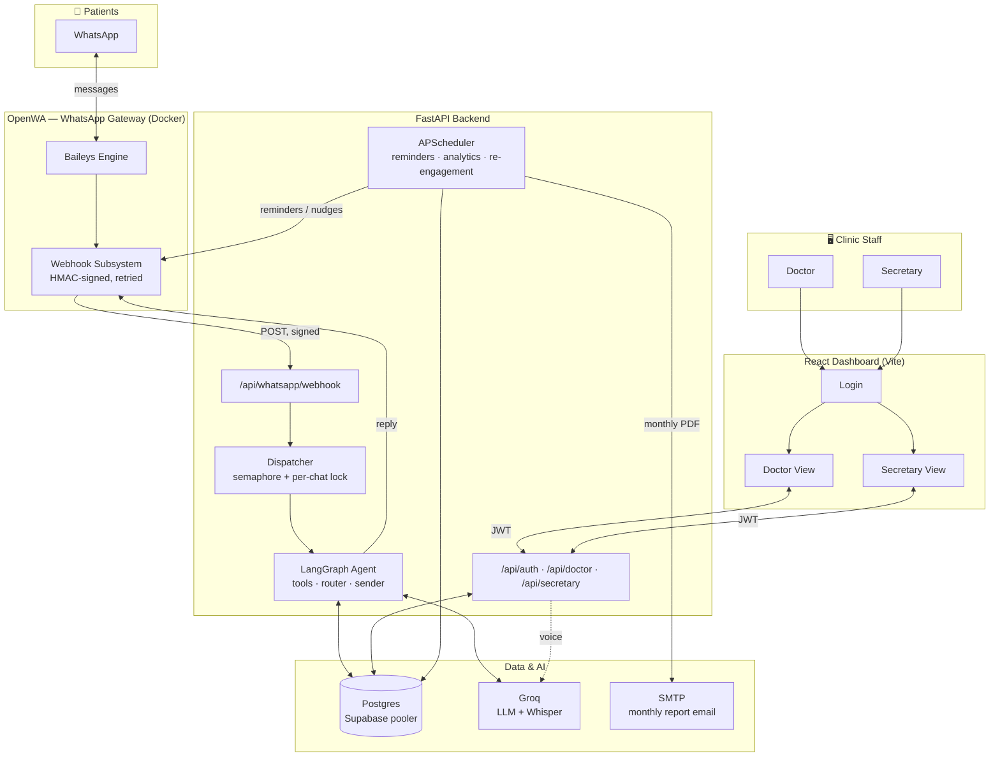
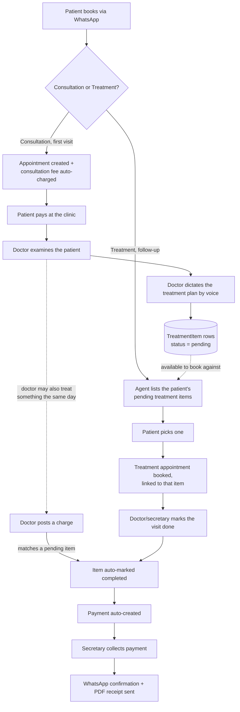
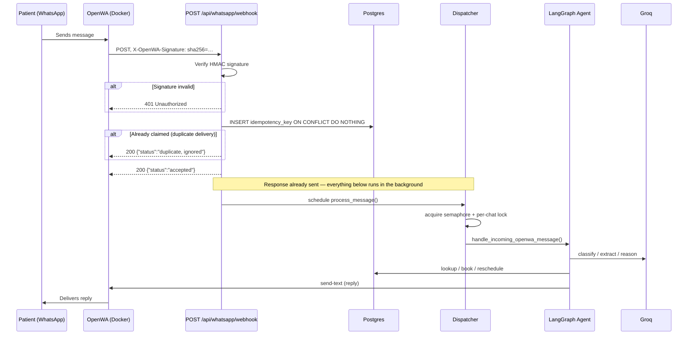

# 🦷 Egyptian Dental Clinic — AI Operations Platform

**A single-clinic system where patients book over WhatsApp and staff run the clinic from a browser — no polling, no manual dispatch, no guesswork on capacity.**

[](pyproject.toml)
[](pyproject.toml)
[](clinic_frontend/package.json)
[](app/database.py)
[](app/whatsapp_agent/graph.py)
[](load-tests/webhook_load_test.js)
[](#-license)

> **Status:** local-development stack, actively iterated. Not yet deployed to a public environment — see [Deployment](#-deployment).

---

## 📖 Table of Contents

- [Overview](#-overview)
- [Key Features](#-key-features)
- [System Architecture](#-system-architecture)
- [How the System Works](#-how-the-system-works)
- [Patient Treatment Workflow](#-patient-treatment-workflow)
- [Webhook Architecture](#-webhook-architecture)
- [Load Testing with k6](#-load-testing-with-k6)
- [Technology Stack](#-technology-stack)
- [Project Structure](#-project-structure)
- [Installation & Setup](#-installation--setup)
- [Running the Project](#-running-the-project)
- [Testing](#-testing)
- [Performance](#-performance)
- [Security](#-security)
- [Deployment](#-deployment)
- [Limitations & Future Improvements](#-limitations--future-improvements)
- [Project Flow Summary](#-project-flow-summary)
- [License](#-license)

---

## 🩺 Overview

A dental clinic runs on two things: **who's coming in today**, and **who owes what**. This project exists because both of those were being tracked by hand — a phone that had to be answered to book an appointment, and a notebook to track payments.

The system has two halves that share one Postgres database:

1. **A WhatsApp booking agent** — patients text the clinic in Egyptian Arabic ("عايز احجز معاد بكرة الساعة ٤"), and a LangGraph-driven agent looks them up, checks real availability, books the slot, and confirms — all without a human touching it. Voice notes are transcribed automatically.
2. **A staff dashboard** — the doctor posts procedures performed (by voice, transcribed and priced against a real catalogue) and reviews monthly analytics with LLM-written insights; the secretary runs the daily schedule, collects payments, and reconciles the till.

Everything reads and writes the *same* appointments/patients/payments tables — a booking made over WhatsApp appears on the secretary's screen instantly, and a reschedule from the dashboard sends the patient a WhatsApp notice automatically.

---

## ✨ Key Features

| | |
|---|---|
| 💬 **WhatsApp booking agent** | Book / reschedule / cancel in Egyptian Arabic, via LangGraph + Groq, with a two-tier fast/full model router |
| 🎙️ **Voice everywhere** | Patients can send voice notes to book; the doctor can dictate a whole visit's charges out loud |
| ⚡ **Event-driven, not polled** | Messages arrive via an HMAC-signed webhook the instant they're sent — see [Webhook Architecture](#-webhook-architecture) |
| 🔒 **Concurrency-safe by design** | Per-patient locking + a bounded semaphore let independent conversations run in parallel without corrupting shared state |
| 📊 **Self-writing analytics** | Monthly revenue, no-show cost, patient retention — summarized into Arabic business insights by an LLM, auto-emailed as a PDF on the 1st |
| 🔁 **Automatic patient care** | A scheduler sends day-before reminders and nudges patients inactive 6+ months, with no human trigger |
| 🧾 **Real financial trail** | Every discount and insurance adjustment is logged with who changed it and why — not just the final number |
| 🦷 **Persistent treatment plans** | The doctor dictates what a patient needs by voice; it's saved as a real plan the patient can book against later over WhatsApp — see [Patient Treatment Workflow](#-patient-treatment-workflow) |
| 🧪 **Load-tested, not assumed** | The webhook's real concurrency ceiling was measured with k6, not guessed — see [Load Testing](#-load-testing-with-k6) |

---

## 🏗️ System Architecture



**Component responsibilities**

| Component | Responsibility |
|---|---|
| **OpenWA** (Docker container) | Self-hosted WhatsApp gateway (Baileys engine). Owns the WhatsApp session, exposes a REST API for sending, and pushes inbound messages out via its own outbound-webhook subsystem. |
| **`app/whatsapp_agent/`** | Receives the webhook, verifies it, dedups it, and runs the LangGraph booking agent — tools, router, candidate-based sender, voice transcription. |
| **`app/routers/`** | The staff-facing REST API — auth, doctor actions, secretary actions. JWT-gated. |
| **`app/scheduler.py`** | APScheduler jobs that run without any human trigger: daily reminders, monthly analytics + email, re-engagement nudges. |
| **Postgres (Supabase)** | Single source of truth for patients, appointments, payments, procedures, treatment plans, and analytics snapshots — read and written by *both* halves of the system. RLS enabled on every table. |
| **Groq** | LLM calls (booking-agent reasoning, monthly insights, voice-charge extraction) and Whisper transcription (voice notes, in both directions). |
| **React dashboard** | Doctor and secretary screens — JWT auth, plain `fetch`, no global state library. |

---

## 🔄 How the System Works

**A WhatsApp message, end to end:**

1. A patient sends a WhatsApp message (text or voice) to the clinic's number.
2. OpenWA's Baileys engine receives it and — because a webhook is registered for `message.received` — POSTs it to the backend within milliseconds, no polling involved.
3. The backend verifies the HMAC signature, atomically claims the message's idempotency key (so a retried delivery is never processed twice), and immediately returns `200 OK` — the actual work hasn't started yet.
4. A background task picks it up: voice notes get transcribed first; the message is handed to the LangGraph agent inside a per-chat lock (so two messages from the *same* patient can never race each other) and a global semaphore (so at most `WHATSAPP_AGENT_CONCURRENCY` conversations run their LLM calls at once).
5. The agent looks the patient up (or registers them) deterministically from their WhatsApp number — it never asks a patient to state a phone number it already has — checks real availability against the `appointments` table, and books/reschedules/cancels through nine dedicated tools.
6. The reply is sent back through OpenWA's send-text API, with a candidate-based fallback (resolved contact → raw ID → alternate ID form) so one bad address doesn't silently swallow a reply.

**A dashboard request, end to end:**

1. Doctor or secretary logs in (`POST /api/auth/login`) — bcrypt-verified, a 12-hour JWT comes back.
2. Every subsequent request carries `Authorization: Bearer <token>`; `require_doctor`/`require_secretary` dependencies gate each router by role.
3. Requests hit Postgres directly through SQLAlchemy — the same tables the WhatsApp agent writes to, so a booking made five minutes ago over WhatsApp is already on the secretary's "today" screen.
4. Voice-driven actions (the doctor dictating charges) go through Groq Whisper for transcription and a structured-output LLM call for extraction — but pricing is **always** resolved against the real `procedures` table, never trusted from the model.

---

## 🦷 Patient Treatment Workflow

The booking agent originally treated every appointment the same. This closes the real clinical loop: **first visit → fee → examination → a treatment plan the doctor didn't have to type → the patient booking against that plan later → the visit being completed → payment → a WhatsApp receipt** — all without a separate "Receipt" table or a new payment gateway, reusing what already existed wherever possible.

### The full lifecycle



### Appointment types

Every appointment now carries an `appointment_type`: **`consultation`** (a first visit / check-up) or **`treatment`** (addressing a specific item already on the patient's plan). Booking a consultation automatically creates its fee as a `pending` `Payment` — the consultation fee is itself just a seeded `Procedure` row (`كشف`), priced and editable exactly like every other procedure, not a separate hardcoded constant. There's no online payment gateway in this project — a deliberate decision, not an oversight, since every payment here is already collected in person by the secretary — so the WhatsApp agent tells the patient the amount and that it's payable at the clinic, same as how every other payment already works.

### The doctor's voice treatment plan

Mirrors the existing voice-charge feature's exact pattern — nothing new invented: record → Groq Whisper transcribes → a structured LLM call extracts each item (procedure, tooth area, general vs. tooth-specific) → the doctor reviews and edits before anything is saved → `POST /api/doctor/treatment-plan` commits it as persistent `TreatmentItem` rows (`pending` / `in_progress` / `completed`). The new `app/voice_treatment_plan.py` module directly reuses `voice_charge.py`'s patient/procedure matching functions rather than duplicating them.

### Booking against the plan, later

When a returning patient asks for a "treatment" appointment, the agent calls a new `get_pending_treatments` tool, reads their pending items back to them, and books the appointment linked to whichever one they pick (`treatment_item_id` on the appointment). The doctor sees exactly what the patient is coming in for before they arrive.

### Closing the loop — two ways an item gets completed

1. **Explicit visit completion** — the doctor or secretary marks the appointment `done` (this is a deliberate, staff-controlled action, never inferred from posting a charge or saving a plan). If it's a `treatment`-type appointment, its linked `TreatmentItem` is automatically marked `completed` and a payment is auto-created, priced from the item's own procedure.
2. **Same-visit charging** — if the doctor treats something during today's visit that happens to match a *pending* item (same procedure, same tooth area), posting that charge via the existing `/charges` endpoint automatically completes the matching item too — no separate step needed. This covers the real case where a doctor does a quick filling during a consultation instead of waiting for a dedicated follow-up.

### Payment → WhatsApp receipt

Collecting a payment (the existing `POST /payments/{id}/collect` flow — unchanged) now also sends the patient a WhatsApp confirmation text and a generated PDF receipt as a document attachment. There's no separate `Receipt` model — the receipt is rendered on demand from the `Payment` row (`reports.generate_payment_receipt_pdf`), and the payment's own `id` doubles as the receipt number, mirroring how the monthly analytics PDF is already a rendering of computed data with no dedicated table behind it. Sending a document over WhatsApp reuses OpenWA's existing `send-document` API — no new integration.

### Doctor patient history (database only)

A new `GET /api/doctor/patients/{id}` gives the doctor a read-only view of a patient's past appointments and what happened at each — sourced strictly from the database, never reconstructed from a voice draft. The frontend reuses the secretary's existing `PatientDirectory` component (made endpoint-configurable rather than duplicated) as a new "Patient History" tab.

### Two real bugs found while building this

- **A hung database connection pool.** Every DB-touching request in the running backend started silently hanging forever mid-testing. Root cause: `app/database.py`'s SQLAlchemy engine had no connection timeout, so when Supabase's pooler silently dropped an idle connection (the exact same failure mode already fixed once for the WhatsApp agent's own connection), `pool_pre_ping`'s health check hung indefinitely on a half-dead socket instead of failing fast and reconnecting. Fixed by adding the same `connect_timeout`/`keepalives` settings already used elsewhere.
- **Missing Row Level Security.** Supabase's security advisor flagged 4 tables with RLS disabled — every one of them added during this project's active development, unlike the original schema (which already had RLS enabled from day one). The backend connects as the `postgres` role (table owner, bypasses RLS automatically), so this had zero effect on the app itself, but it left those tables open on Supabase's auto-generated public REST API. Fixed by enabling RLS with no policies on all four (`analytics_snapshots`, `failed_whatsapp_sends`, `processed_whatsapp_messages`, `treatment_items`).

---

## 🪝 Webhook Architecture

This is the part of the system that changed most recently, and the part most worth understanding — the agent used to *poll* OpenWA every 10 seconds; it now receives a **push** the instant a message arrives.

### What triggers it

OpenWA's own outbound-webhook subsystem. When a WhatsApp message is received (or sent, acknowledged, etc. — this project subscribes to `message.received` only), OpenWA POSTs a signed JSON payload to a URL registered against the session.

### The endpoint

| | |
|---|---|
| **URL** | `POST /api/whatsapp/webhook` |
| **Auth** | `X-OpenWA-Signature: sha256=<hmac>` — HMAC-SHA256 over the raw request body, keyed by `WHATSAPP_WEBHOOK_SECRET` |
| **Registration** | Automatic, on every backend startup (`app/whatsapp_agent/registration.py`) — creates or updates the subscription so nothing needs manual re-registration after a restart |
| **Processing** | Asynchronous — the handler ACKs in well under a second; the actual agent run happens in a background task |

### Payload shape (as consumed by this backend)

```json
{
  "event": "message.received",
  "sessionId": "…",
  "idempotencyKey": "msg_<session>_<waMessageId>_<webhookId>",
  "deliveryId": "dlv_<uuid>",
  "data": {
    "id": "…",
    "from": "201xxxxxxxxx@c.us",
    "chatId": "201xxxxxxxxx@c.us",
    "type": "text",
    "body": "عايز احجز معاد",
    "fromMe": false,
    "isGroup": false,
    "media": { "mimetype": "audio/ogg", "data": "<base64>" }
  }
}
```

### Request flow



### Validation & processing, step by step

1. **Signature verification** — computed over the *raw* bytes before JSON parsing; a missing or wrong signature is a `401` before anything else runs.
2. **Idempotency claim** — an `INSERT … ON CONFLICT DO NOTHING` against a dedicated `processed_whatsapp_messages` table. This is the *real* dedup — OpenWA's own idempotency key is advisory only, and OpenWA does not guarantee at-most-once delivery.
3. **Relevance filter** — drops group messages (checked two ways: the explicit `isGroup` field *and* the `@g.us` suffix), broadcasts, newsletters, and the clinic's own outbound messages (`fromMe`).
4. **Fast ACK** — a `200` is returned immediately via FastAPI `BackgroundTasks`, before the LLM is ever called. This matters because OpenWA's own delivery timeout is 10 seconds; anything slower gets treated as a failed delivery and retried.
5. **Background processing** — voice transcription (if needed), the LangGraph agent run, and the reply send all happen after the response has already gone out.

### Error handling & retries

- **Transport-level retries** are OpenWA's job — up to 3 attempts with exponential backoff on a non-2xx or timeout. This project deliberately does **not** rely on that for business-logic correctness: a message is claimed (and therefore never reprocessed) the instant it's received, regardless of whether the *agent's own* processing later succeeds or fails.
- **Business-logic failures** (a crashed LLM call, a DB error) are caught inside the background task, logged, and answered with a single generic apology — never retried automatically, because retrying at that layer is exactly what caused a real double-reply bug earlier in this project's history (see the git history / commit notes on the notebook's `FIX 22`).

### Security considerations

- HMAC-SHA256 signature, verified with a constant-time comparison (`hmac.compare_digest`), over the raw body.
- SSRF protection lives on **OpenWA's** side (it refuses to register a webhook pointed at a loopback/private address by default) — this project's own registration URL is allow-listed there explicitly rather than disabling that protection.
- The webhook secret and all API keys live in `.env`, never committed.

### Synchronous vs. asynchronous

Everything after signature verification and the idempotency claim is asynchronous. This is the single most important design decision in this subsystem — it's also the thing a load test caught a real bug in (see below).

### Local development & tunneling

- OpenWA runs in Docker; the backend runs directly on the host — so from *inside* the container, `127.0.0.1`/`localhost` resolve to the container itself, not the host. The webhook is registered against **`host.docker.internal`** instead (Docker Desktop's built-in route back to the host), with that hostname explicitly allow-listed past OpenWA's SSRF guard.
- `ngrok` is present in the repo for the case where OpenWA needs to reach a backend that *isn't* on the same machine (e.g. testing against a real phone from a different network) — not required for the same-machine Docker setup described above.

---

## 🧪 Load Testing with k6

### What k6 is, and why it's here

[k6](https://k6.io) is a scriptable HTTP load-testing tool (Grafana Labs) — you write a small JavaScript file describing virtual users and what they do, and it reports latency percentiles, throughput, and error rates under real concurrent load. It's used here for one reason: **assumptions about concurrency are worth nothing until they're measured.** The webhook handler *looked* non-blocking; k6 proved it wasn't.

### What's being tested

`POST /api/whatsapp/webhook` — specifically the **ACK layer**: how fast the endpoint can verify a signature, claim an idempotency key, and hand off to a background task, under real concurrent load. This is the layer that matters for OpenWA's 10-second delivery timeout.

### Test design (`load-tests/webhook_load_test.js`)

```js
export const options = {
  scenarios: {
    webhook_burst: {
      executor: 'shared-iterations', // precise total volume, not an open-ended ramp
      vus: 25,                       // peak concurrency
      iterations: 45,                // total requests for the whole run
      maxDuration: '90s',
    },
  },
  thresholds: {
    webhook_ack_latency: ['p(95)<2000'], // OpenWA's real timeout is 10s — set stricter to catch regressions early
    webhook_rejected: ['count==0'],
  },
};
```

Each virtual user posts a properly HMAC-SHA256-signed `message.received` payload with a **unique `chatId` and `idempotencyKey`** per iteration — every request represents a distinct simulated patient, so the test genuinely exercises cross-conversation concurrency rather than hammering one dedup key.

**Why only 45 requests, not thousands:** every new synthetic chat costs one real Groq API call (the router's first-message classification). Groq's free tier caps around 30 requests/minute; 45 was enough to comfortably exceed both that ceiling and the app's own concurrency semaphore, without burning a third party's quota for no additional signal. `shared-iterations` (a fixed total, not `vus`+`duration`) makes that volume exact and reproducible.

### Results

The first run **failed its own threshold** — and in doing so, caught a real bug: the idempotency-claim query was running synchronous `psycopg2` I/O directly inside the `async def` handler, so every concurrent request queued behind the same blocked event loop.

| Metric | Before fix | After fix |
|---|---|---|
| p95 ACK latency | 8.69s ❌ | **1.61s** ✅ |
| Max ACK latency | 9.62s | 1.84s |
| Avg ACK latency | 4.47s | 1.32s |
| Total wall time (45 req) | 11.1s | 3.3s |
| Throughput | 4.06 req/s | **13.47 req/s** |
| Accepted / rejected | 45 / 0 | 45 / 0 |

Fix: wrap the blocking claim in `asyncio.to_thread(...)` so it runs off the event loop — no other request has to wait behind it.

### Running it yourself

```bash
winget install -e --id GrafanaLabs.k6
cd load-tests
k6 run -e WEBHOOK_SECRET=<WHATSAPP_WEBHOOK_SECRET from .env> webhook_load_test.js
```

### Reading the output

- **`p(95)` / `p(90)`** — the latency 95%/90% of requests beat. This matters more than the average, because an average hides a bad tail — a p95 of 8.69s with an average of 4.47s means a meaningful chunk of *every* concurrent burst was approaching OpenWA's real 10s timeout, one bad request away from a false "delivery failed."
- **`webhook_rejected: count==0`** — a non-zero count here means the endpoint itself is returning errors under load, not just being slow. Distinguishing *slow* from *broken* is the whole point of separate thresholds.
- **Throughput rising while latency also rises** is a classic saturation signal — the system is accepting more work than it can actually finish promptly, and a queue is building somewhere (in this case: the asyncio event loop, waiting on a blocking DB call).

### What this test can (and can't) reveal

It measures the receiver's own concurrency ceiling — not Groq's, not OpenWA's. Those live one layer downstream and were only observed indirectly here: across both runs (90 real Groq calls total), zero rate-limit errors surfaced, which is reported as an honest observation rather than a claim that Groq's published ~30 req/min limit doesn't apply — the app's own 5-way semaphore plus real LLM latency naturally spaces calls out under this test's specific load shape.

---

## 🧰 Technology Stack

### AI / Agent

| | Why |
|---|---|
| **LangGraph** | State-machine orchestration for the booking agent — tool-calling, conditional routing, per-thread memory |
| **Groq** (`openai/gpt-oss-120b` / `-20b`) | Fast, free-tier-friendly inference; two model sizes let a cheap classifier handle simple turns and reserve the larger model for complex ones |
| **Groq Whisper (`whisper-large-v3`)** | Arabic voice-note transcription, used by both the WhatsApp agent and the doctor's voice-charge feature |
| **LangChain** (core, community, groq, openai, huggingface integrations) | Structured-output parsing, message primitives, tool decorators |

### Backend

| | Why |
|---|---|
| **FastAPI** | Async-native, typed, auto-documented REST API |
| **SQLAlchemy** | ORM for the dashboard's data access |
| **psycopg2** | Direct driver used by the WhatsApp agent (autocommit mode, deliberately separate from the ORM session — see [Limitations](#-limitations--future-improvements)) |
| **APScheduler** | In-process cron jobs (reminders, analytics, re-engagement) — no separate worker service needed at this scale |
| **python-jose + passlib[bcrypt]** | JWT issuing/verification and password hashing |
| **ReportLab + arabic-reshaper + python-bidi** | Arabic-correct (RTL-shaped) PDF generation for the monthly report |

### Frontend

| | Why |
|---|---|
| **React 19** | Dashboard UI |
| **Vite** | Dev server + build tooling |
| **react-router-dom v7** | Three-route app (`/login`, `/doctor`, `/secretary`) with role-gated redirects |
| **Recharts** | Revenue/visits trend charts, procedure breakdown bars |

### Infrastructure & Data

| | Why |
|---|---|
| **PostgreSQL (Supabase, transaction pooler)** | Single shared database for both the dashboard and the WhatsApp agent |
| **OpenWA (Docker, Baileys engine)** | Self-hosted WhatsApp gateway — outbound webhook subsystem, `@lid`-contact resolution, no third-party WhatsApp Business API dependency |
| **Docker / Docker Compose** | Runs OpenWA in isolation from the host Python/Node toolchain |

### Testing

| | Why |
|---|---|
| **k6** | Real concurrency measurement of the webhook receiver — see above |

---

## 📁 Project Structure

```
Clinic/
├── app/                          # FastAPI backend
│   ├── main.py                   # App wiring: lifespan, routers, CORS, UTF-8 stdout fix
│   ├── models.py                 # SQLAlchemy models (Patient, Doctor, Appointment, Payment, …)
│   ├── database.py               # Engine/session (Postgres via Supabase pooler)
│   ├── auth.py                   # JWT issuing/verification, bcrypt, role dependencies
│   ├── scheduler.py               # APScheduler jobs: reminders, monthly analytics, re-engagement
│   ├── analytics.py               # Revenue/no-show/retention analytics + LLM insights
│   ├── reports.py / email_sender.py  # Monthly PDF report + email delivery
│   ├── voice_charge.py            # Doctor's voice → transcription → structured charge draft
│   ├── voice_treatment_plan.py    # Doctor's voice → structured treatment-plan draft (mirrors voice_charge.py)
│   ├── whatsapp.py                # Proactive (non-conversational) WhatsApp sends + document/receipt sending
│   ├── receipts.py / config.py    # Receipt photo storage (secretary uploads); clinic-wide constants
│   ├── routers/                   # auth.py · doctor.py · secretary.py
│   └── whatsapp_agent/            # The event-driven booking agent
│       ├── webhook.py             # POST /api/whatsapp/webhook — signature, dedup, ACK
│       ├── dispatcher.py          # Per-chat lock + concurrency semaphore
│       ├── handler.py             # Payload → agent handoff, voice vs. text
│       ├── graph.py                # LangGraph state machine, system prompt, router
│       ├── tools.py                # lookup/register/book/reschedule/cancel/… (9 tools)
│       ├── sender.py               # Candidate-based WhatsApp reply sender
│       ├── transcription.py        # Voice-note → text (Groq Whisper)
│       ├── db.py                   # Thread-local psycopg2 connections
│       ├── llm.py / config.py      # Model clients; shared constants
│       └── registration.py         # Self-registers the webhook with OpenWA on startup
│
├── clinic_frontend/               # React + Vite dashboard
│   └── src/
│       ├── pages/                  # Login, DoctorView, SecretaryView (+ sub-views)
│       ├── components/             # AppShell, Sidebar, TopBar, DateStrip, StatTile, TrendChart
│       ├── auth/AuthContext.jsx     # JWT persistence + role hydration
│       └── api.js                  # fetch-based API client
│
├── OpenWA/                        # Self-hosted WhatsApp gateway (Docker, Node/NestJS)
├── load-tests/
│   └── webhook_load_test.js       # k6 script — see above
│
├── agent_Start.ipynb               # WhatsApp agent notebook (reference / manual testing)
├── add_*.py                        # Idempotent DB migrations (no Alembic — see Setup)
│   ├── add_treatment_workflow.py   # treatment_items table, appointment/payment linkage, consultation-fee procedure
│   └── add_rls_hardening.py        # Enables RLS on the 4 tables Supabase's advisor flagged
├── migrate_sqlite_to_pg.py         # One-off legacy-SQLite → Postgres carry-over
├── seed_users.py                   # CLI to create the first doctor/secretary users
├── pyproject.toml / uv.lock         # Python deps (uv-managed)
└── .env                            # All secrets/config (never committed)
```

---

## ⚙️ Installation & Setup

### Prerequisites

- Python 3.14+ with [uv](https://docs.astral.sh/uv/)
- Node.js (for the frontend and OpenWA)
- Docker Desktop (for OpenWA)
- A Supabase (or any Postgres) database
- API keys: Groq (required), SMTP credentials (optional, for the monthly email)

### Environment variables (`.env`, repo root)

| Variable | Purpose |
|---|---|
| `DATABASE_URL` | Postgres connection string (Supabase transaction pooler, port 6543) |
| `JWT_SECRET` | Signs dashboard login tokens |
| `GROQ_API_KEY` | LLM + Whisper calls |
| `OPENWA_URL` / `OPENWA_API_KEY` / `OPENWA_SESSION_ID` | Talking to the WhatsApp gateway |
| `WHATSAPP_WEBHOOK_SECRET` | HMAC key for verifying inbound webhook deliveries |
| `WHATSAPP_AGENT_CONCURRENCY` | Max concurrent conversations processed at once (default 5) |
| `BACKEND_PUBLIC_URL` | Where OpenWA should reach the backend (`http://host.docker.internal:8001` for the local Docker setup) |
| `SMTP_HOST` / `PORT` / `USER` / `PASSWORD`, `DOCTOR_EMAIL` | Optional — monthly report email; skipped silently if unset |

> `DEEPSEEK_API_KEY`, `OPEN_ROUTER`, `HF_TOKEN`, `TWILIO_*`, `ngrok` also appear in `.env` from earlier experimentation with alternative LLM/voice providers not currently wired into the active code path — **confirm before relying on them**.

### Install

```bash
# Backend
uv sync

# Frontend
cd clinic_frontend && npm install

# OpenWA
cd OpenWA && docker compose up -d
```

### Database migrations

No Alembic — each `add_*.py` script at the repo root is a standalone, idempotent migration (`ADD COLUMN IF NOT EXISTS`, `CREATE TABLE IF NOT EXISTS`). Run them once, in any order, against a fresh database:

```bash
.venv\Scripts\python.exe add_doctor_user_link.py
.venv\Scripts\python.exe add_receipt_column.py
.venv\Scripts\python.exe add_reminders_and_analytics.py
.venv\Scripts\python.exe add_whatsapp_opt_in.py
.venv\Scripts\python.exe add_whatsapp_agent_state.py
.venv\Scripts\python.exe add_treatment_workflow.py
.venv\Scripts\python.exe add_rls_hardening.py
.venv\Scripts\python.exe seed_users.py   # creates your first doctor + secretary login
```

---

## 🚀 Running the Project

```bash
# 1. OpenWA — WhatsApp gateway (only if not already running)
cd OpenWA && docker compose up -d

# 2. Backend — also starts the scheduler and self-registers the webhook
.venv\Scripts\python.exe -m uvicorn app.main:app --host 127.0.0.1 --port 8001 --reload

# 3. Frontend
cd clinic_frontend && npm run dev -- --port 5173
```

Open **http://localhost:5173**. Do **not** run the notebook's `run_polling_loop()` cell — the backend now owns live WhatsApp traffic via webhook; running both would double-reply to patients.

---

## ✅ Testing

| Layer | Method | Status |
|---|---|---|
| Webhook signature / idempotency / relevance filtering | Manual signed-payload requests (curl / Python scripts) during development | ✅ Verified |
| Webhook concurrency | k6 load test, 25 VU / 45 req | ✅ Verified — see [Load Testing](#-load-testing-with-k6) |
| End-to-end booking flow | Real WhatsApp messages against a live OpenWA session | ✅ Verified manually |
| Treatment workflow (consultation fee → voice plan → treatment booking → completion → payment → receipt) | Full live run against a real OpenWA session with a test patient, cleaned up after | ✅ Verified manually |
| REST API (auth/doctor/secretary routers) | Manual HTTP testing during feature development | ✅ Exercised, not automated |
| Automated unit / integration test suite (pytest, etc.) | — | ❌ **Not yet implemented** — flagged under [Future Improvements](#-limitations--future-improvements) |
| Frontend component tests | — | ❌ **Not yet implemented** |

---

## 📈 Performance

Numbers below are from the k6 run described above, measured against a local backend on the same machine as OpenWA.

- **ACK latency (webhook receiver):** p95 **1.61s** at 25 concurrent virtual users / 45 total requests, after the async-DB fix (was 8.69s before).
- **Throughput:** 13.47 requests/sec sustained through the ACK layer at that concurrency.
- **Concurrency ceiling, by layer:**
  1. `WHATSAPP_AGENT_CONCURRENCY=5` — this app's own semaphore, the first real limit a burst of traffic hits.
  2. Groq free tier — roughly 30 req/min, ~1,000/day, per model.
  3. OpenWA's own delivery concurrency (10 concurrent) and self-imposed inbound API rate limit (100 req/60s).
- **Not yet measured:** dashboard REST API latency under load, Postgres connection saturation under many simultaneous WhatsApp conversations, frontend bundle/render performance.

---

## 🔐 Security

| Area | Implementation |
|---|---|
| **Dashboard auth** | JWT (HS256), 12-hour expiry, bcrypt password hashing, role-gated route dependencies (`require_doctor` / `require_secretary`) |
| **Webhook auth** | HMAC-SHA256 over the raw request body, constant-time comparison, verified before any JSON parsing |
| **Idempotency** | Durable DB-backed dedup — a replayed/retried webhook delivery can never trigger the agent twice |
| **Secrets** | All in `.env`, never committed; separate secret per concern (JWT vs. webhook vs. API keys) |
| **SSRF protection** | Enforced by OpenWA on webhook registration; the local dev target is allow-listed explicitly rather than the protection being disabled |
| **Row Level Security (Postgres)** | Enabled on every table, including the 4 added mid-project that initially shipped without it (`add_rls_hardening.py`) — closes Supabase's auto-generated public REST API surface; zero effect on the app itself, which connects as the table-owning `postgres` role and bypasses RLS regardless |
| **CORS** | Currently `allow_origins=["*"]` — appropriate for local development, **must be restricted before any public deployment** |
| **API rate limiting (backend)** | ❌ Not implemented on the FastAPI side — only OpenWA's own inbound API is self-rate-limited. Flagged under Future Improvements. |
| **Receipt/media file access** | Served as static files under `/uploads` — no auth check on the static route itself; access relies on the paths being unguessable UUIDs, not a real permission check |

---

## 🚢 Deployment

**Current state: local development only.** There is no Dockerfile for the backend, no CI/CD pipeline, and no hosting configuration for the frontend or backend beyond Supabase hosting the database. This section describes what exists today and what would be needed for a real deployment — the latter is explicitly a recommendation, not something already built.

**What's already deployment-ready:**
- Postgres is already externally hosted (Supabase) — no local-DB migration needed.
- Configuration is fully environment-variable-driven — no hardcoded hosts/secrets in code (aside from the frontend's `BASE_URL`, which is currently hardcoded to `http://127.0.0.1:8001` in `src/api.js` and would need to become an env-driven build-time value).

**What a production deployment would need (not yet done):**
- A Dockerfile (or equivalent) for the FastAPI backend, run behind a real ASGI server config (not `--reload`).
- A public HTTPS URL for `BACKEND_PUBLIC_URL` — the webhook registration would point at that instead of `host.docker.internal`, and OpenWA's SSRF allow-list would need the real hostname.
- CORS restricted to the actual frontend origin.
- A static hosting target for the built React app, with `api.js`'s base URL made configurable per environment.
- Secrets management appropriate to the hosting platform, replacing the flat `.env` file.
- Backend-level rate limiting, given the API currently has none of its own.

---

## ⚠️ Limitations & Future Improvements

**Known limitations today:**
- The WhatsApp agent uses a raw `psycopg2` connection (thread-local, autocommit) that is architecturally separate from the dashboard's SQLAlchemy session — two data-access patterns in one codebase. Unifying them is a real refactor, not yet done.
- `sqlalchemy` is imported directly by `app/database.py`/`app/models.py` but isn't listed in `pyproject.toml`'s own dependency list (only in the older `requirements.txt`) — worth resolving explicitly rather than relying on it arriving transitively.
- `reports.py`'s PDF generation depends on a Windows-only font path (`C:\Windows\Fonts\tahoma.ttf`) — flagged in-code as needing a bundled TTF before any non-Windows deployment.
- No automated test suite (see [Testing](#-testing)).
- No structured logging, error tracking (e.g. Sentry), or metrics/observability platform — current visibility is stdout logs only.
- CORS is wide open and there's no backend rate limiting (see [Security](#-security)).

**Realistic near-term improvements:**
- A pytest suite covering the router layer and the WhatsApp agent's tool functions.
- Backend Dockerfile + a real production deployment target.
- Structured logging + basic request tracing/health metrics.
- Unify the two database-access patterns (SQLAlchemy vs. raw psycopg2) in the WhatsApp agent.

**Possible longer-term directions:**
- Multi-doctor / multi-clinic support (the schema already has a `Doctor` model, but the agent currently hardcodes `doctor_id=1`).
- A proper task queue (e.g. Celery/Redis) if the clinic's message volume ever outgrows an in-process APScheduler + semaphore.
- Interactive WhatsApp message types (lists/buttons) — evaluated during this project and deliberately deferred, since OpenWA has no support for them today and official WhatsApp Business API is a much larger integration.

---

## 🧭 Project Flow Summary

A patient WhatsApps the clinic → OpenWA pushes it to the backend via a signed webhook → the backend ACKs instantly and books/reschedules/cancels through a LangGraph agent running against the same Postgres the dashboard reads → the reply goes back out through OpenWA. Meanwhile, the doctor and secretary work from a React dashboard against that same database — posting charges (sometimes just by talking), collecting payments, and reviewing analytics an LLM has already summarized into plain Arabic. A scheduler quietly sends reminders and re-engagement nudges every day without anyone asking it to. The whole webhook path was measured under real concurrent load with k6, not assumed to be fine — and that measurement caught a real bug before a patient ever could.

---

## 📄 License

No license file is currently present in this repository — usage terms are unspecified. Add a `LICENSE` file to make this explicit before any external distribution.
